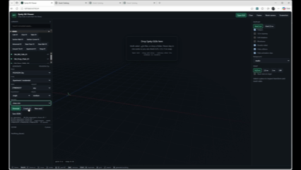

# Synty Pack Inventory

**`synty-inventory`** — offline scanner and query CLI. It turns **your** Synty
packs into per-pack JSON catalogs so you or an agent can search by meaning —
what a sign depicts, how it mounts, which floor it belongs on, which kit
family a wall module belongs to, which socket a ship engine mates to —
instead of guessing from filenames like `SM_Prop_Sign_Police_01`.

**One catalog, every engine.** A Synty pack is the same set of meshes in
Unity, Unreal, Godot and as converted GLBs for three.js. The catalog records
each asset once (semantics, measured bounds, assembly data) and lists the
per-engine file under `files.{unity_prefab,unity_mesh,glb,unreal_uasset,
godot_scene}`. `--engine` only chooses which file path to print; it never
changes what the asset *is*.

Does **not** need the Unity Editor. This repo is **not** affiliated with
Synty Studios. It does **not** include Synty assets or generated catalogs.

Requires Python 3.11+ and Synty packs you already license.

## Quick start

```bash
python -m venv .venv
# Windows: .venv\Scripts\activate
# macOS/Linux: source .venv/bin/activate

pip install -r requirements.txt
```

Copy the example config and set the three required roots to **your** disks:

```bash
# Windows cmd
copy config.example.yaml config.yaml

# Windows PowerShell
Copy-Item config.example.yaml config.yaml

# macOS/Linux
cp config.example.yaml config.yaml
```

Edit `config.yaml`:

| Key | What it points at |
|---|---|
| `unity_root` | Folder of original `*.unitypackage` files (not extracted assets) |
| `extracted_root` | Extracted pack trees, one folder per `pack_id` (`POLYGON_City`, …) |
| `catalogs` | Where this tool writes JSON catalogs (keep this **outside** git) |

Optional keys: `viewer_data` (asset-viewer `generate/data` — measured AABBs,
sign overlays and building-type grammars, if you have them; not in this
repo), `threejs_v2` (converted GLB tree with per-pack `manifest.json` /
`catalog.json`; used for `files.glb`, offline mesh measurement and the
VLM-reviewed descriptions). Any key can
also be set with `SYNTI_UNITY_ROOT`, `SYNTI_EXTRACTED_ROOT`, `SYNTI_CATALOGS`,
`SYNTI_VIEWER_DATA`, `SYNTI_THREEJS_V2`, or `--config PATH`.

```bash
synty-inventory config
synty-inventory scan
synty-inventory search "police"
```

After install, the CLI is `synty-inventory` (same as `python -m synty_inventory`).
`config` prints each resolved path, whether it exists, and whether it came
from the file or the environment. A wheel/sdist also ships
`config.example.yaml` and `skill.md` inside the package (`example_file` in
the `config` output).

## Why

A filename does not tell an agent that a police plaque sits above the door
on floors 1–2, or that a barber pole is a side-projecting first-floor
identity piece. The catalog does.

That is what the inventory is for: query by meaning, then instantiate the
prefab. Here an agent uses the catalog while generating a building from
pack pieces in Unity:



## Layout

```
src/synty_inventory/   scan, enrich, query
skill/SKILL.md         skill (copy into ~/.grok/skills/synty-inventory/)
assets/synty-tools.gif demo: catalog-driven building assembly in Unity
config.example.yaml    template — copy to config.yaml
config.yaml            local paths (gitignored; do not commit)
LICENSE / NOTICE       Apache-2.0 + third-party asset notice
tests/
```

Catalogs are written to the `catalogs:` path. Each pack is
`<pack_id>.json` (schema `version: 2`; v1 files are migrated on read).

### What a v2 asset record carries

| Field | Meaning |
|---|---|
| `placeable`, `kind` | `false` / `animation`, `ui`, `skeleton`, `material`, … for things an assembler must never drop into a scene (clips, HUD, skyboxes). `search`/`suggest` hide them unless `--include-nonplaceable`. |
| `type` | enumerated: `building/shell`, `building/interior_module`, `vehicle/spacecraft`, `vehicle/part`, `sign`, `prop`, … |
| `semantic_role` + `semantic_detail` | enumerated role (`building_identity`, `advertisement`, `vehicle_part`, …) plus free detail (`police_station`, `displays_burger`, `engine`). |
| `placement` | `mount`, `attachment`, `preferred_floors`, `constraints`, `preferred_contexts` — all enumerated. |
| `bounds` | `{min,max,size,pivot,source}` in metres, **measured** from the GLB (or asset-viewer AABB); `null` until measured — never a guess. `dimensions.approx` mirrors `bounds.size`; `size_hint` is the rule-based remnant for unmeasured pieces. |
| `module` | kit data for modular building pieces: `family` (`Apartment`, `Shop`, …), `role` (`hero`, `shell`, `corner`, `door`, `roof`, `stairs`, `floor`, `base`), `footprint_class`, `stackable_on`, `street_side`. |
| `part` | ship-kit data: `class` (`body`, `cockpit`, `engine`, `wing`, `gear`, `greeble`), `mates_axis`, `symmetric`, `size_class`, plus mesh-analysed mating faces: `mount` (the face this part attaches with: `axis`, `position`, `normal`, `area`, `extent`, `fit`, `source`) and, for `body` hulls, `sockets[]` (`front`/`rear`/`left`/`right`/`top`/`bottom`, same shape). Positions are in `bounds` space (local, metres); `source: measured` = a flat cap found in the decoded GLB triangles, `aabb` = AABB face-centre fallback (no flat cap — rounded hull end, airfoil wing). Attach child to parent as `parent_pos + socket.position - child.mount.position`. `null` until the GLB is analysed. |
| `files` | `unity_prefab`, `unity_mesh`, `unity_materials`, `glb` (+ `glb_node` for meshes packed in bundle GLBs), `unreal_uasset`, `godot_scene`. `paths` is the v1 alias. |
| `provenance` | per-field source, see precedence below. |

Catalog-level `grid` (`snap 0.25`, module/tile/story sizes) and
`conventions` (street axis `+z`, rotate step, scale `1.0`) are written once
per pack.

### Precedence (who wins on re-scan)

Lowest to highest; a higher rank overwrites a lower one, equal rank refreshes:

| Rank | Source | Examples |
|---|---|---|
| 1 | `rules` | stem-based inference (`knowledge.py`) |
| 2 | `viewer` | asset-viewer roles / sign overlays |
| 3 | `measured` / `vlm` | GLB bounds, unreviewed VLM |
| 4 | `vlm_reviewed` | threejs-v2 `catalog.json` entries with `reviewed: true` |
| 5 | `curated` | hand-written overrides in the package |
| 6 | `human` | anything you edit in the catalog or list in `locked_fields` |

`bounds` never regress (measured is never replaced by a hint). `files.*`,
`placeable`, `kind` and `size_hint` always refresh from disk/rules unless
`human`. `scan --rebuild` discards every non-human field so a precedence or
rule change takes effect everywhere.

## CLI

Paths default from `config.yaml`. Pass a root only to override.

```bash
synty-inventory discover
synty-inventory scan
synty-inventory scan --pack POLYGON_City
synty-inventory list-packs
synty-inventory search "police" --pack POLYGON_City
synty-inventory search "engine" --type vehicle/part --part-class engine --engine threejs
synty-inventory details SM_Prop_Sign_Police_01
synty-inventory suggest "police station facade"
synty-inventory suggest "fighter space ship"        # -> {"recipes":[ship_kit, ...], "assets":[...]}
synty-inventory placement SM_Prop_Sign_Police_01
synty-inventory recipes [--pack POLYGON_City]
synty-inventory recipe ship_kit --engine unity
synty-inventory recipe building_shop --pack POLYGON_City
synty-inventory kit Apartment                      # modules grouped by role
synty-inventory kit "*"                            # every family
synty-inventory validate
synty-inventory gauntlet
```

`search`/`suggest` filters: `--type`, `--role`, `--module-role`,
`--part-class`, `--include-nonplaceable`, `--engine unity|unreal|godot|threejs`.
`suggest` prints `{"recipes": [...], "assets": [...]}` — `--assets-only` gives
the v1 bare list.

### Recipes — how the pieces are meant to be used

A recipe is a grammar: ordered steps, each with a `select` filter over the
catalog (type / role / module role / part class / tags), a count range, a
layout and constraints. `recipe <id>` resolves it against your catalogs and
returns the eligible pieces per step **with bounds and files**, and
`complete: false` (exit 4) if a required step has no candidates. Sources:

- package recipes in `src/synty_inventory/recipes/` — `ship_kit`,
  `station_interior`, `main_street_row`, `apartment_block`;
- asset-viewer building types (`generate/data/types/*.json`) exposed as
  `building_<type>@<pack>` when `viewer_data` is set;
- your own `<catalogs>/recipes/*.json` (same shape; `triggers` drive `suggest`).

Optional scan flags:

- `--include-shared` — also catalog `PolygonGeneric` inside each pack
- `--from-package` — index the `.unitypackage` even when an extracted tree exists
- `--extract-previews` — write Synty `preview.png` files under
  `catalogs/previews/` (do **not** commit or share)
- `--vlm` — optional vision pass (`XAI_API_KEY` / `OPENAI_API_KEY` /
  `SYNTI_VLM_API_KEY`). May upload previews; can conflict with the Synty
  or Unity EULA. Off by default.

Re-scan merges by the precedence table above. Human / `locked_fields` /
`provenance: human` values are kept. Paths always refresh from disk. `scan
--pack` updates that pack and rebuilds `index.json` from **all** catalogs on
disk. `scan --rebuild` keeps only human fields.

Unreal trees are discovered when present; that path is implemented, not
proven against live packs.

`gauntlet` is a live acceptance suite (expects `POLYGON_City` and, for the
assembly gates, `POLYGON_SciFi_Space`): the v1 sign gates plus bounds
coverage >= 95 %, no heuristic dimensions, GLB paths, VLM overlay applied,
ship-part typing, ship-part sockets (every hull six faces, every child part a
mount, >= 80 % of mounts measured caps), every package recipe resolving
`complete`, and
`suggest` pointing assembly prompts at the right recipe. CI uses `pytest`
and a fake fixture pack.

## Mesh analysis

Bounds come from accessor `min`/`max` alone. Ship-part sockets need the real
triangles, so `sources/meshopt.py` carries pure-Python decoders for the
`EXT_meshopt_compression` vertex (v0) and index (v0/v1) codecs the threejs-v2
GLBs use — no native `meshoptimizer` dependency. `sources/glb_geometry.py`
turns a GLB (or one named node of a bundle GLB) into world-space triangles;
`sources/sockets.py` clusters the axis-facing coplanar triangles into caps
and picks the outermost sizeable one per axis. Results are cached in
`_measure_cache.json` under `<glb>#sockets`, keyed by file mtime/size, the
algorithm version and the part class, so rule changes re-analyse.

## Skill

See `skill/SKILL.md`. Copy it to `~/.grok/skills/synty-inventory/SKILL.md`
(or your Claude Code skills dir). Every tool is a `synty-inventory` command
that prints JSON. The skill tells an agent to start from `suggest` -> recipe
-> `recipe <id> --engine <engine>` for assemblies, and `search`/`details`/
`placement` for single pieces.

## Tests

```bash
python -m pytest
```

## License

This software is licensed under the Apache License, Version 2.0. See
`LICENSE` and `NOTICE`.

Apache-2.0 covers this scanner, skill, and docs only. It does not grant
trademark rights in the project name, and it does not license Synty
content.

## Third-party assets

This repository does **not** include Synty Studios packs, source files,
preview images, or generated catalogs. You must own the packs you scan
and follow the [Synty EULA](https://syntystore.com/pages/one-time-purchase-licence)
(and the Unity Asset Store EULA if you bought a pack there).

Synty and POLYGON are trademarks of Synty Studios Limited. This project
is not affiliated with, endorsed by, or sponsored by Synty Studios.

Do not commit or publish `config.yaml`, extracted/original packages,
`--extract-previews` PNG output, or catalog JSON. Keep those on your
machine. `--extract-previews` and `--vlm` can write or upload Synty
artwork; both are optional and your responsibility.
