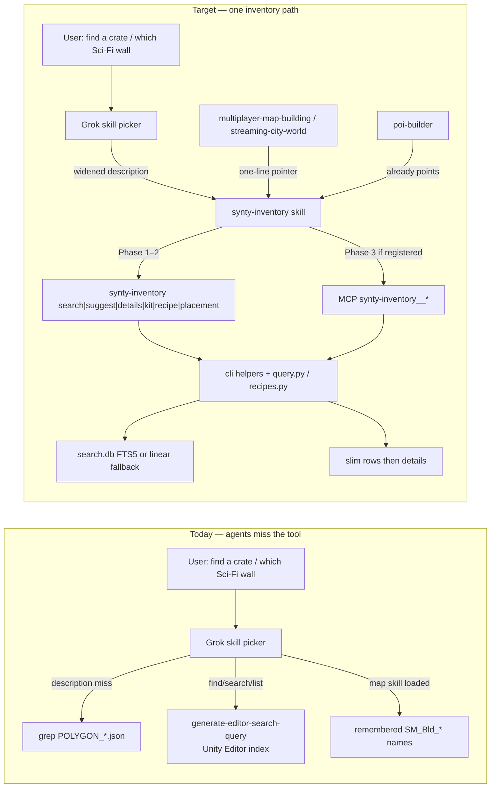
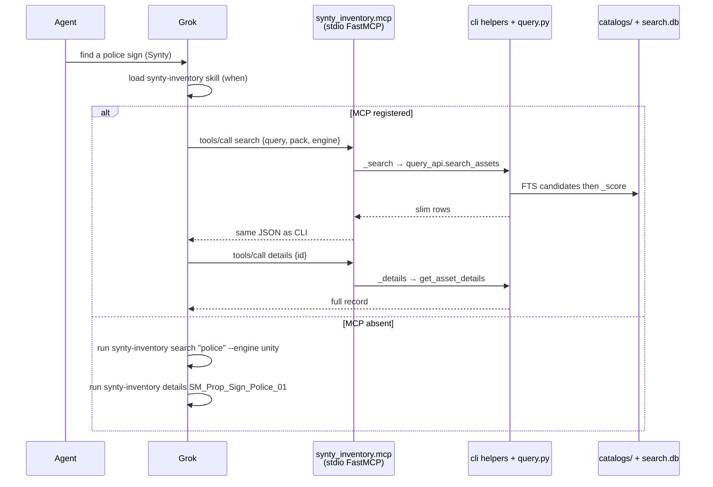
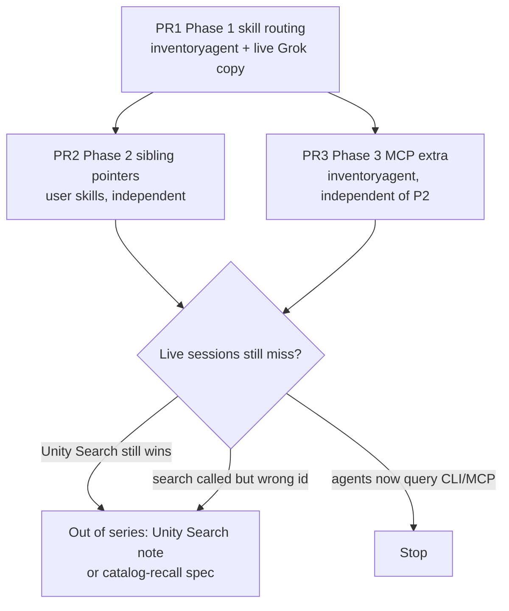

# Make Agents Find Synty Assets via the Existing Inventory

| Field | Value |
|---|---|
| **Status** | Draft |
| **Author** | Tom Swift |
| **Date** | 2026-09-16 |
| **Workspace** | `D:\game_assets_library\synty_catalogs` |
| **Primary repo** | `D:\game_assets_library\tools\inventoryagent` (`main` @ `0037cbb`) |
| **Related conclusion** | Do not build a parallel searcher. Make `synty-inventory` the default path agents actually take. |

---

## Overview

Agents miss Synty pieces because they do not invoke the existing inventory, not because search is missing. The live skill description is catalog/kit/socket-oriented; Unity plugin skill `generate-editor-search-query` hoggs find/search/locate/list for in-Editor prefabs; sibling map skills kitbash from remembered `SM_Bld_*` names and (in one case) never name `synty-inventory`. The catalog, FTS index, slim-row contract, and CLI verbs already exist and work.

This spec routes agents onto that stack: widen the existing `synty-inventory` skill so it loads on piece-find queries, add one-line pointers in sibling skills, and (separately) expose the same CLI verbs as a stdio MCP facade. No second Python searcher, no `synty-search` skill, no ranking rewrite, no catalog rescan.

---

## Background & Motivation

### Current state (verified on disk)

**Catalogs (source of record).** `D:\game_assets_library\synty_catalogs\index.json` — schema version 2, `updated_at` 2026-08-28T12:08:10+00:00. Totals: **13,745** assets / **10,828** placeable / **10,300** measured / **10,410** reviewed across **23** packs. Derived `search.db` sits beside the JSON. Slim list rows are ~200 B; full records live behind `details <id>`.

**Python package / CLI.** Checkout `D:\game_assets_library\tools\inventoryagent\`. Package `src/synty_inventory/`. Entry point `synty-inventory = synty_inventory.cli:main` (`pyproject.toml`). On PATH: `C:\Users\tom-s\AppData\Roaming\Python\Python314\Scripts\synty-inventory.exe`. Config `D:\game_assets_library\tools\inventoryagent\config.yaml` → `catalogs: "D:/game_assets_library/synty_catalogs"`. Env overrides are `SYNTI_*` (`paths.py` `CONFIG_KEYS`).

Query surface already implemented:

| Verb | Implementation | Default JSON |
|---|---|---|
| `search QUERY` | `query.search_assets` | list of slim rows (`limit=20`) |
| `details ID` | `query.get_asset_details` | full record or exit 3 |
| `suggest CONTEXT` | `query.suggest_assets_for` + `suggest_recipes_for` | `{"recipes":[…],"assets":[…]}` (`--assets-only` → bare list, `limit=12`) |
| `placement ID` | `query.get_placement_guidance` | placement/bounds/module/part subset or exit 3 |
| `kit FAMILY` | `recipes.kit_family` / `kit_families` | family → roles → slim rows (`*` = all) |
| `recipe ID` | `recipes.resolve_recipe` | grammar + `resolved_steps[].eligible` slim rows (`limit=16`); exit 4 if `complete` is false (JSON still printed) |
| `recipes` | `recipes.load_recipes` | list of `{id,kind,label,packs,source,steps,triggers}` |
| `list-packs` | `query.list_packs` | pack summaries |
| `config` | `cmd_config` | resolved paths / sources |

Ranking is `query._score` plus a capped BM25 bonus when `search.db` is fresh (`searchdb.py`). Linear catalog walk if the DB is stale or absent. Agents never see that split.

Slim row contract (`project.slim_row`):

```json
{"id": "…", "pack": "POLYGON_City", "type": "…", "role": "…", "size": [x, y, z], "file": "…", "score": 12.3}
```

Optional keys only when present: `sockets`, `slots`, `kit`, `kit_role`, `part_class`, `glb_node`. `--engine unity|unreal|godot|threejs|all` selects `files.*` / `file` only. `--fields a,b,c` copies named full-record fields onto list rows. `footprint` is never in a default row.

**Live skill (two copies that must stay in sync).**

- Canonical edit target: `D:\game_assets_library\tools\inventoryagent\skill\SKILL.md`
- Packaged wheel copy: `D:\game_assets_library\tools\inventoryagent\src\synty_inventory\skill.md` (banner: `<!-- packaged copy of ../../skill/SKILL.md — edit that file, then copy -->`)
- Live Grok skill: `C:\Users\tom-s\.grok\skills\synty-inventory\SKILL.md` (copy of the checkout file, no banner)

`tests/test_paths.py::test_packaged_example_and_skill_exist` asserts checkout ↔ packaged after stripping the banner. README (`## Skill`) already documents the copy rule. There is no test that the Grok user-skill copy matches; that copy is local-only.

**Current frontmatter description** (all three files, 2026-09-16):

```
Search, select and assemble Synty POLYGON pack assets for Unity, Unreal,
Godot or three.js from one engine-neutral catalog: what a sign depicts, how
it mounts, measured bounds, kit family/role for modular buildings, ship-part
class/mating axis, mech slot/bone attachments, and recipes (building
grammars, ship kits, mech kits, street rows). Covers the city, sci-fi,
military/war and crime packs. Use when dressing a scene with Synty pieces,
procedurally assembling buildings / city blocks / spaceships / mechs from
modules, or when the user runs /synty-inventory.
```

The body already says: do not place from filename; query CLI; slim first, details second; `--engine` only selects `files.*`. It does **not** name Unity Search, and it does **not** forbid grepping `POLYGON_*.json`.

### Pain points (routing, not missing search)

1. **Skill description does not fire on piece-find phrasing.** “Find a crate”, “cover lip”, “police sign”, “which Sci-Fi City wall”, “search the catalog”, “which POLYGON prefab” are absent. Agents skip the skill and grep JSON or guess `SM_Bld_*` names.

2. **Unity plugin skill wins the find/search/locate/list verbs.** `C:\Users\tom-s\.grok\installed-plugins\unity-agent-plugin-c9dc9089\skills\generate-editor-search-query\SKILL.md` description: *“Always use when the user asks to find, search, show, locate, filter, look up, query, or list concrete assets or scene objects in the current project or scene, even if Unity Search is not named.”* That is the in-Editor index. It has no measured bounds, kit role, sockets, or engine-neutral `files.*`. Plugin files are overwritten on update; do not edit them.

3. **Sibling map skills do not force the CLI.**
   - `poi-builder` is already correct (description negative + sibling table).
   - `multiplayer-map-building` kitbashes `SM_Bld_Section_*` / `SM_Bld_Large_*` from remembered families (`SKILL.md` §4 and `references/modular-assembly.md`). It never names `synty-inventory`.
   - `streaming-city-world` owns pack-per-cell and kitbashes `SM_Bld_Section_*` by remembered name. **Never names `synty-inventory`.** Already recorded as the failure mode this spec exists to fix; `inventoryagent/tasks/lessons.md` does not currently carry this lesson (it is bash-heredoc notes only).

4. **CLI construction is friction.** Agents must load a long skill, then assemble `synty-inventory search "…" --pack P --engine unity`. An MCP facade over the same functions is easier to call. That is Phase 3, not a new searcher.

---

## Goals & Non-Goals

### Goals

1. Agents looking for a Synty / POLYGON piece load `synty-inventory` instead of grepping catalogs or opening Unity Search.
2. Sibling map/POI skills point at `synty-inventory` for **which piece**; they keep owning layout, cells, and stamp rails.
3. Optional MCP tools return the same JSON object graph as the CLI query verbs. Thin verbs call `query.*` / `recipes.*`; `recipe` / `kit` / `recipes` / `config` call shared CLI-layer helpers extracted from `cmd_*` so id-lookup, `*` dispatch, viewer grammars, and the config payload are not duplicated.
4. Skill copies stay in sync: checkout canonical, packaged copy, live Grok copy.
5. Phase 1–2 ship without MCP. MCP is independently reviewable.

### Non-goals

- No second Python search tool or package.
- No second agent skill (`synty-search` or similar).
- No grepping `POLYGON_*.json` / pack catalogs as the search implementation.
- No reimplementation of `_score`, FTS, or ranking in MCP.
- No `synty-inventory review` (Ollama) revival.
- No catalog rescan, vision pass, or footprint rebuild as part of this work.
- No Unity Editor dependency for inventory search.
- No change to recipe / kit / placement semantics, slim-row shape, or `--engine` meaning.
- No drive-by refactor of skill body assembly rails (skill-design-principles: do not refactor unrequested redundancy).
- No architect/builder/operator/reviewer tree under `.grok`.

---

## Key Decisions

1. **Routing, not a new searcher.** The catalog + FTS + CLI already search 13,745 assets. The bug is invocation. Rationale: a parallel tool would drift, split ranking, and violate one-home-per-fact.

2. **One skill name: `synty-inventory`.** Widen its description; do not mint `synty-search`. Rationale: Grok deduplicates by name; a second skill would compete with the owner of assembly rails.

3. **Phase 1 is description + two hard negatives only.** Body assembly/recipe text stays. Rationale: skill-design-principles (avoid sprawl / no-op guardrails). The two negatives (grep pack JSON; Unity Search for measured catalog) prevent observed mis-routes, so they are not no-ops.

4. **CLI contract frozen in Phase 1–2.** No ranking rewrite, no new flags. Rationale: markdown-only PRs; gauntlet stays untouched.

5. **Sibling skills get a pointer, not a restatement.** One line + owner name. Do not copy bounds/socket/placement rules. Rationale: one home per fact (`synty-inventory` owns piece pick).

6. **`poi-builder` is already correct — leave it unless a live miss is shown.** Its description already says *“Do NOT use for picking a catalog id alone — that is synty-inventory.”* Sibling table already lists “Which piece, bounds, kit role, sockets | `synty-inventory`”. Tightening would be sprawl.

7. **Unity plugin skill is not edited.** A user-skill override is a **gated decision after Phase 1**, out of this PR series. Rationale: plugin files are overwritten; a same-named user skill does **not** suppress the plugin copy (it stays under `plugin:name`). Phase 1 description must compete on its own first. If a later one-liner is needed, land it on `unity-mcp-orchestrator` (the live `name:` of `~\.grok\skills\unity-mcp-skill\SKILL.md`), not a `synty-search` skill.

8. **MCP is a facade, not a subprocess and not a reimplementation of search.** Thin verbs (`search`, `details`, `suggest`, `placement`, `list-packs`) call `query.*` directly. `recipe`, `kit`, `recipes`, and `config` call **shared helpers extracted from `cli.cmd_*`** (id lookup, `*` / `all` kit dispatch, viewer-backed recipe summaries, `resolve_config` payload). Rationale: those four verbs’ CLI JSON is not `recipes.resolve_recipe(id)` / `kit_family` / `load_recipes` / `load_config` raw. Extracting helpers is a Phase 3 internal refactor with **no verb JSON or exit-code change**. Serialize with `cli.dumps`. CLI remains the fallback if MCP is absent.

9. **MCP handlers are `mcp`-free; FastMCP is lazy-imported in `main()`.** Module-level `_search`, `_details`, … raise domain errors with CLI stderr text and return `cli.dumps(...)`. `main()` imports FastMCP, registers those functions under CLI verb names, `SystemExit`s on `ImportError` with `pip install synty-inventory[mcp]`, then `mcp.run()` (stdio). Rationale: `import synty_inventory.mcp` must work without the extra (pytest CI); `@mcp.tool()` at import time cannot. On the wire, FastMCP wraps every handler exception as `Error executing tool {name}: {e}` — that wrapped string is the agent-visible contract, not byte-identical CLI stderr.

10. **MCP is an optional extra (`synty-inventory[mcp]`), stdio, no network.** No `[project.scripts]` entry for the server (setuptools scripts cannot be extra-gated). Normative run: `py -3.14 -m synty_inventory.mcp`. Rationale: user profile is local-first / zero API cost; core CLI must keep installing with numpy/PyYAML/jsonschema only. Mixamo on this machine already uses `mcp>=1.0` + FastMCP.

11. **Catalog recall (`CONTEXT_ALIASES`, FTS extra fields, stills in results) is Phase 4 and gated.** Only after agents actually call `search` and we can show misses. Rationale: ranking work before routing work would optimize a path agents do not take.

12. **Skill edit is authored in the inventoryagent checkout and copied two ways.** Canonical: `skill/SKILL.md`. Then copy (a) to `src/synty_inventory/skill.md` with the packaged-copy banner, (b) to `~\.grok\skills\synty-inventory\SKILL.md` without the banner. Rationale: existing L3 convention + `test_packaged_example_and_skill_exist`. Do not add a build-time copy hook in this work. Do not edit README in Phase 1 — `## Skill` already documents both copy destinations.

---

## Proposed Design

### Architecture (today vs target)



Unity Search remains correct for **in-project** prefabs/scene objects. It is wrong for pack inventory, measured bounds, kit role, sockets, and engine file paths.

### Phase 1 — Skill routing (do first; markdown-only in inventoryagent)

**Files (author in this order):**

1. `D:\game_assets_library\tools\inventoryagent\skill\SKILL.md` — **canonical**
2. `D:\game_assets_library\tools\inventoryagent\src\synty_inventory\skill.md` — packaged copy (keep the existing first-line banner, then the same body as (1))
3. `C:\Users\tom-s\.grok\skills\synty-inventory\SKILL.md` — live Grok copy of (1), no banner

Do not edit the live Grok file first. Do not invent a fourth copy.

#### 1.1 Proposed frontmatter (replace the current `description` block)

Keep `name: synty-inventory`. Add `when-to-use` (Grok reads this for invocation separately from the body; bundled skills already use it). Do not add `synty-search`.

```yaml
---
name: synty-inventory
description: >
  Find, search, pick, and assemble Synty POLYGON / SIDEKICK pack assets
  for Unity, Unreal, Godot or three.js (crates, signs, cover, walls,
  modules, prefabs, kit pieces) from the measured engine-neutral catalog:
  catalog id, measured bounds, kit family/role, sockets, engine file
  paths, what a sign depicts, how it mounts, ship-part class, mech slots,
  and recipes. Covers the city, sci-fi, military/war and crime packs.
  Use when the user asks which Synty / POLYGON piece or prefab to use;
  to find a crate, cover lip, police sign, Sci-Fi City wall, or catalog
  id; to search the Synty catalog; when dressing a scene with Synty
  pieces; when assembling buildings / city blocks / spaceships / mechs
  from modules; or when they run /synty-inventory. Do NOT use Unity
  Search or generate-editor-search-query for pack inventory, measured
  bounds, kit role, sockets, or engine paths. Do NOT grep POLYGON_*.json
  as search.
when-to-use: >
  Use when asked to find, search, pick, locate, or list a Synty / POLYGON
  / SIDEKICK / catalog piece, prefab, module, crate, sign, cover, wall,
  or catalog id; when they ask which Synty / POLYGON / SIDEKICK / catalog
  asset for X; when they need measured bounds, kit role, sockets, or
  engine paths for a Synty pack piece; or when they run /synty-inventory.
  Do not use for in-Editor Unity Search of project assets already imported
  into the open scene — that is generate-editor-search-query.
---
```

Why both `description` and `when-to-use`: Grok matches **both** fields for auto-invoke (`08-skills.md`). Bundled skills `review`, `implement`, and `design` already use `when-to-use`; user skill `gauntlet` does too. Putting find/search/crate/sign in **both** is the routing fix, but every find/search/list/`which asset` clause must keep a Synty / POLYGON / SIDEKICK / catalog noun — unbounded “which asset for X” would steal in-Editor prefab lookup (skill-design-principles: do not overgeneralize). Keep the combined frontmatter shorter than a page; do not paste the CLI table into YAML. Engine names and pack-family words from the live description stay so “Unreal Synty piece” / “crime pack prop” still match.

#### 1.2 Hard negatives in the body (insert after the existing opening paragraph, before `## Slim rows first`)

The opening paragraph already says “Do not place Synty assets from the filename alone. Query `synty-inventory`…”. Add only the two mis-routes that currently happen. Do not restate assembly rails.

```markdown
Do not grep pack catalog JSON (`POLYGON_*.json`, `SIDEKICK_*.json`,
`SIMPLE_*.json`, `ANIMATION_*.json`, `INTERFACE_*.json`) as search —
that is not the query path. Use `search` / `suggest`. Reading
`<catalogs>/index.json` for pack totals / kit names / recipe ids is
still correct.

Do not use Unity Search / `generate-editor-search-query` for pack
inventory, measured bounds, kit role, sockets, or engine file paths.
That skill is the in-Editor project index.
```

`index.json` stays allowed: the skill already requires reading it first for “what is here”. The forbidden act is treating per-pack JSON as a search index.

Do **not** add “do not invent `SM_Bld_*` from memory” as a third bullet — the existing “Do not place from the filename alone” already covers it (avoid no-op guardrails).

#### 1.3 CLI contract unchanged

Do not touch `cli.py`, `query.py`, `searchdb.py`, `project.slim_row`, or recipe JSON. Phase 1 is three markdown files.

Do **not** mention MCP in the Phase 1 skill. If MCP is absent, that sentence would be a no-op. MCP invocation guidance lands in Phase 3.

#### 1.4 Sync procedure (explicit)

From the inventoryagent checkout, after editing `skill/SKILL.md`:

```powershell
# Packaged copy: banner + body. Keep the existing first line.
# Then the remainder must match skill/SKILL.md byte-for-byte.

Copy-Item -Force skill\SKILL.md $env:USERPROFILE\.grok\skills\synty-inventory\SKILL.md
```

Packaged `src/synty_inventory/skill.md` is **not** a raw copy: it must start with:

```
<!-- packaged copy of ../../skill/SKILL.md — edit that file, then copy -->
```

blank line, then the canonical file. `test_packaged_example_and_skill_exist` uses `_canonical_text()` to strip that banner. A Phase 1 PR that updates only `skill/SKILL.md` will fail that test until the packaged copy is updated.

README `## Skill` already says copy `skill/SKILL.md` to `~/.grok/skills/synty-inventory/SKILL.md` and copy checkout → packaged. **Do not edit README in Phase 1.** The test-gap (pytest does not cover the Grok user-skill path) is this spec’s verification step (`fc` / `Compare-Object`), not a README rewrite.

### Phase 2 — Sibling pointers (one line each)

Sibling skills live under `C:\Users\tom-s\.grok\skills\` (user scope, not the inventoryagent git tree). Edits are local apply + a reviewable diff; they are not merged via inventoryagent `main`.

Do not copy placement / bounds / socket / recipe rules into these files.

#### 2.1 `poi-builder` — no change in the first pass

File: `C:\Users\tom-s\.grok\skills\poi-builder\SKILL.md`

Already present:

- Description: *“Do NOT use for picking a catalog id alone — that is synty-inventory.”*
- Body: *“Query `synty-inventory` for ids, `bounds`, `module` / `kit`, `placement`.”*
- Sibling table: *“Which piece, bounds, kit role, sockets | `synty-inventory`”*

Leave it. If a live session after Phase 1 still picks POI-builder to search the catalog, then tighten the description negative to mention `search|suggest|details` — that is a follow-up, not this PR.

#### 2.2 `multiplayer-map-building`

File: `C:\Users\tom-s\.grok\skills\multiplayer-map-building\SKILL.md`

`references/modular-assembly.md` stays the stamp/snap/kitbash owner. Do not restamp those rails. Do not replace the remembered-family table in that file (it is the mating how-to, not the catalog). The skill body is what fails to force a catalog query before a remembered `SM_Bld_Large_01`.

**Description — append to the existing `Do NOT use` cluster** (after the streaming-city-world negative, before `metadata:`):

```
Do NOT use for picking a Synty catalog id, measured bounds, kit role,
sockets, or engine file path — that is synty-inventory.
```

**Body — add a sibling row and one line at the start of §4 Assemble modular pieces.**

New row in a short sibling table (the skill currently has no sibling table; add a two-row table after Hard rails, or a single sentence — prefer a table so it matches `poi-builder` / `streaming-city-world` without restating catalog fields):

```markdown
## Sibling tools

| Job | Owner |
|---|---|
| Layout spec, snap, stamp, kitbash order, Arena | **this skill** |
| Which Sci-Fi City piece (id, bounds, kit role) after gates | `synty-inventory` |
```

At the top of **§4 Assemble modular pieces**, after “Assembly only chooses **which** Sci-Fi City piece sits there and **how** it mates.”, add:

```
Pick the piece with `synty-inventory search|suggest|details` (and `kit` /
`recipe` when assembling a module family). Do not grep pack JSON and do
not guess `SM_Bld_*` from memory. Mating, snap, and stamp stay in
`references/modular-assembly.md`.
```

That is the entire Phase 2 change for this skill. Do not add a CLI cheat-sheet.

#### 2.3 `streaming-city-world`

File: `C:\Users\tom-s\.grok\skills\streaming-city-world\SKILL.md`

Currently missing `synty-inventory` entirely. Pack-per-cell stays this skill.

**Description — append:**

```
Do NOT use for picking which piece inside a pack — that is synty-inventory.
```

**Delegation table (already exists under `## Delegation`) — add one row:**

```
| Which piece inside the cell's pack (id, bounds, kit role) | `synty-inventory` |
```

**§4 First cell — after “Then kitbash:”, before the snap bullets, one line:**

```
Pack-per-cell is this skill. Which piece inside that pack is
`synty-inventory` (`search` / `suggest` / `details`; `kit` / `recipe` when
assembling modules).
```

Do not paste slim-row JSON or placement rules here.

#### 2.4 Decision: Unity Search user-skill override — **not in Phase 1–2**

Plugin path (do not edit):

`C:\Users\tom-s\.grok\installed-plugins\unity-agent-plugin-c9dc9089\skills\generate-editor-search-query\SKILL.md`

Grok docs (`08-skills.md`): a user skill of the same name overrides a **bundled** skill; a **plugin** skill of the same name does **not** override a native skill and stays available as `plugin:name`. So a `~\.grok\skills\generate-editor-search-query\SKILL.md` copy would sit beside the plugin skill, not replace it. `[skills].disabled` would disable by name and could take out both.

**Gate (out of this series):** ship Phase 1–2. Watch live sessions for “find a Synty crate” still opening Unity Search. Do not fork the 119-line plugin skill. Do not invent `synty-search`. If a later one-liner is needed, the Unity MCP user skill’s real `name:` is `unity-mcp-orchestrator` (`C:\Users\tom-s\.grok\skills\unity-mcp-skill\SKILL.md`); it currently points at `find_gameobjects`, not pack inventory. `unity-cli` never mentions Synty. That follow-up is a new spec, not PR 4 of this work.

### Phase 3 — Optional MCP facade (separate PR)

First-class MCP tools wrapping the **same** functions as the CLI query verbs. No new ranking, no new schema, no network.



#### 3.1 Where it lives

| Item | Choice |
|---|---|
| Module | `D:\game_assets_library\tools\inventoryagent\src\synty_inventory\mcp.py` |
| Run | `py -3.14 -m synty_inventory.mcp` (stdio). `if __name__ == "__main__": raise SystemExit(main())`. **No** `[project.scripts]` entry — setuptools console scripts cannot be extra-gated; a core-install `synty-inventory-mcp` would fail at import. |
| Dep | Optional extra: `[project.optional-dependencies] mcp = ["mcp>=1.0"]`. Core install stays numpy / PyYAML / jsonschema. FastMCP is already the Mixamo pattern on this machine (`D:\tools\mixamo-mcp\mcp_server.py`, `mcp>=1.0`). |
| Transport | stdio only. No HTTP/SSE, no bind, no API key. |
| Config | Same `paths.find_config_file` / `load_config` as the CLI. Catalogs from `config.yaml` / `SYNTI_CATALOGS`. Never hardcode `D:/game_assets_library/...`. `cwd` in the Grok TOML must be the inventoryagent checkout so `./config.yaml` resolves (`checkout_root()` is `None` for a non-editable wheel). |
| Relation to skill | Skill still owns **when** and assembly rails. MCP owns **invocation** of query verbs. CLI remains correct if MCP is unregistered. |

**Import rules (normative):**

- `import synty_inventory.mcp` **must succeed** without the `mcp` extra. No `from mcp...` at module top. Handlers `_search`, `_details`, `_suggest`, `_placement`, `_kit`, `_recipe`, `_recipes`, `_list_packs`, `_config` live at module level.
- `main()` lazy-imports FastMCP. On `ImportError`, print `pip install synty-inventory[mcp]` to stderr and `SystemExit(1)`. Then construct `FastMCP("synty-inventory")`, register the `_` handlers with explicit `name=` (`search`, `details`, …, `list_packs`, `config`), and call `mcp.run()` (FastMCP default `transport="stdio"`, same as Mixamo).
- Tests import the `_` handlers always. The FastMCP wrap test uses `pytest.importorskip("mcp")` and **must not** call `main()` / `mcp.run()` (stdio would hang).

Do not put the server under a new package, a new repo, or `~/.grok/` scripts. Do not shell out to `synty-inventory.exe`. Do not decorate handlers with `@mcp.tool()` at import time.

#### 3.2 Server registration (Grok)

**The Mixamo-style user TOML is the only install recipe.** `grok mcp add` does **not** record `cwd` (`07-mcp-servers.md` has no such claim). Live Mixamo sets `cwd` explicitly in `C:\Users\tom-s\.grok\config.toml`. `paths.find_config_file` looks at cwd `config.yaml` then `checkout_root()`; a wheel install has `checkout_root() is None`, so missing `cwd` → missing catalogs.

Pin the **same 3.14 interpreter** that owns `synty-inventory.exe` (`C:\Users\tom-s\AppData\Roaming\Python\Python314\Scripts\synty-inventory.exe`), not an unspecified `python` on PATH. Discover with `py -3.14 -c "import sys; print(sys.executable)"` after `py -3.14 -m pip install -e ".[mcp]"` from the checkout.

```toml
[mcp_servers.synty-inventory]
command = "py"
args = ["-3.14", "-m", "synty_inventory.mcp"]
cwd = 'D:\game_assets_library\tools\inventoryagent'
enabled = true
startup_timeout_sec = 30
```

If someone still runs `grok mcp add synty-inventory -- py -3.14 -m synty_inventory.mcp`, they must then edit the TOML to set `cwd` (or export `SYNTI_CONFIG` / `SYNTI_CATALOGS`). That add-CLI path is not equivalent to the block above.

Server name `synty-inventory` is legal (letters/numbers/hyphens). Grok namespaces tools as `synty-inventory__search`, `synty-inventory__details`, etc. (`07-mcp-servers.md`).

Do not commit machine `cwd` into the inventoryagent repo. Document the TOML snippet in README (Phase 3, ~15 lines under `## Skill` or a short MCP subsection). User-scope is enough for this machine. Project-scoped `.grok/config.toml` is optional later.

#### 3.3 Tools and schemas

Expose the **query** verbs only. Do not wrap `scan`, `enrich`, `vision`, `gauntlet`, `review`, `footprint`, `scene-mine`, `validate`, `discover`. Those are write/admin.

`config` is included so an agent can see resolved catalog roots without guessing.

CSV CLI flags (`--tags a,b`) become string arrays in MCP. `None` / omitted = same as CLI default.

**Shared enums**

- `engine`: `unity | unreal | godot | threejs | all | null` (null = CLI default, unspecified → GLB-first `primary_file`)
- `fields`: array of top-level record field names (`description`, `placement`, `part`, `mech`, `bounds`, `files`, `footprint`, …). Same as `--fields`. Default empty = slim rows.

Return type for every tool: JSON **string** produced by `cli.dumps` (identical object graph to CLI **stdout**). FastMCP wraps it as a text content block. Do not invent a second envelope (`{ok, data}`).

##### Errors: handler vs on-the-wire

Handlers raise `InventoryLookupError` (a local `Exception` subclass in `mcp.py`, **not** FastMCP `ToolError`) with the **exact CLI stderr line** (`cli._fail` text). FastMCP’s tool wrapper (`mcp/server/fastmcp/tools/base.py` lines 116–117) catches **every** `Exception`, including `ToolError`, and re-raises `ToolError(f"Error executing tool {self.name}: {e}")`. Mixamo does not use `ToolError`. Pin the import path only inside `main()` if needed: `from mcp.server.fastmcp.exceptions import ToolError` — handlers must not import it.

| CLI | Handler (direct call / pytest) | On the wire (`tools/call`) |
|---|---|---|
| exit 3, stderr `asset not found: X` / `recipe not found: X` / `no module family matches: X` / `ambiguous recipe X: […]` | `InventoryLookupError` with that string | `Error executing tool {name}: {that string}` |
| exit 4, JSON still printed (`recipe` incomplete) | return `dumps(out)` (`complete: false`); do not raise | same JSON |
| exit 2, JSON still printed (`config` with missing required paths) | return `dumps(payload)`; do not raise | same JSON (payload already has `exists: false`) |
| `ConfigError` (unreadable / missing config file) | `InventoryLookupError` or re-raise `ConfigError` with the same text | `Error executing tool {name}: {ConfigError text}` |

Document the **wrapped** form in the skill’s MCP paragraph so agents do not expect a byte-identical CLI stderr line. Tests must cover both layers (§3.7).

##### Shared CLI-layer helpers (Phase 3, extract from `cli.py`)

These exist so MCP does not copy-paste `cmd_*` and so `recipes.resolve_recipe` is never called with a string id. `cmd_*` become thin wrappers. **No change** to JSON shape, flags, or exit codes.

| Helper | Extracted from | Behavior |
|---|---|---|
| `config_payload(config_path=None) -> dict` | `cmd_config` | `resolve_config`; `{config_file, example_file, paths: {key: {path, exists, source}}}`. Caller maps `missing_required` to CLI exit 2; MCP ignores the exit and returns the dict. |
| `list_recipe_summaries(catalogs_dir, viewer_data, pack=None) -> list[dict]` | `cmd_recipes` | `recipes.load_recipes(catalogs_dir, viewer_data)` then project `{id,kind,label,packs,source,steps,triggers}` and optional pack filter. `viewer_data` is `_optional_root(cfg, "viewer_data")` — **required** so `asset_viewer_types` grammars are not dropped. |
| `lookup_recipe(recs, recipe_id, pack=None) -> dict` | `cmd_recipe` lines 409–418 | exact id, else unique `id@pack` when `id.split("@")[0]` matches (and pack filter). Raises builtin `LookupError` with `ambiguous recipe {id}: {cands}` or `recipe not found: {id}` (`cli.py` must not import `mcp.py`). `cmd_recipe` catches and `_fail(..., 3)`. Then caller runs `recipes.resolve_recipe(catalogs_dir, rec, ...)`. |
| `kit_or_families(catalogs_dir, family, pack, engine, fields)` | `cmd_kit` | if `family` in `{"*", "all"}` (case-insensitive for `all`): `recipes.kit_families(...)`. Else `recipes.kit_family(...)`; empty → `LookupError("no module family matches: {family}")`. |

`cmd_search` remains the adapter `_csv(args.type) → types=`. MCP `search` does that mapping in `_search` (table below) rather than another helper.

##### MCP arg → function kwarg (every tool)

Import the query module as `query_api` so an MCP parameter named `query` cannot shadow it.

**`search`** — `query_api.search_assets`. Tool description: *“Search the Synty pack catalog by meaning. Same as `synty-inventory search`. Returns slim rows (~200 B): id, pack, type, role, size[m], file, score; optional sockets/slots/kit/kit_role/part_class/glb_node. Then call details for the picked id. Not Unity Search.”*

| MCP arg | Type | Default | CLI | `search_assets` kwarg |
|---|---|---|---|---|
| `query` | string, required | — | positional | positional `query` |
| `pack` | string \| null | null | `--pack` | `pack` |
| `tags` | string[] \| null | null | `--tags` CSV | `tags` |
| `category` | string[] \| null | null | `--category` | `category` |
| `constraints` | string[] \| null | null | `--constraints` | `constraints` |
| `limit` | int | 20 | `--limit` | `limit` |
| `type` | string[] \| null | null | `--type` | **`types`** |
| `role` | string[] \| null | null | `--role` | **`roles`** |
| `module_role` | string[] \| null | null | `--module-role` | **`module_roles`** |
| `part_class` | string[] \| null | null | `--part-class` | **`part_classes`** |
| `footprint_class` | string[] \| null | null | `--footprint-class` | **`footprint_classes`** |
| `include_nonplaceable` | bool | false | `--include-nonplaceable` | `include_nonplaceable` |
| `engine` | enum \| null | null | `--engine` | `engine` |
| `fields` | string[] \| null | null | `--fields` | `fields` |

Passing `type=` into `search_assets` is a `TypeError`. The handler must spell `types=type`, `roles=role`, `module_roles=module_role`, `part_classes=part_class`, `footprint_classes=footprint_class`.

**`details`** — `query_api.get_asset_details(catalogs_dir, id)`. MCP arg `id` (required string) → `asset_id_or_name`. `None` → `InventoryLookupError("asset not found: {id}")`. Returns full record including `pack_id`, `pack_style`, `engine`, `source`.

**`suggest`** — `query_api.suggest_assets_for` + `query_api.suggest_recipes_for`.

| MCP arg | Type | Default | Function |
|---|---|---|---|
| `context` | string, required | — | `suggest_assets_for(..., context)` and `suggest_recipes_for(..., context, viewer_data)` |
| `pack` | string \| null | null | `suggest_assets_for` `pack` |
| `limit` | int | 12 | `suggest_assets_for` `limit` |
| `include_nonplaceable` | bool | false | same |
| `engine` | enum \| null | null | same |
| `fields` | string[] \| null | null | same |
| `assets_only` | bool | false | if true, return the assets list only (CLI `--assets-only`); else `{"recipes": matched, "assets": assets}` |

`viewer_data=_optional_root(cfg, "viewer_data")` (same as `cli._viewer`). Without it, `suggest` recipes omit viewer grammars.

**`placement`** — `query_api.get_placement_guidance(catalogs_dir, id)`. `None` → `InventoryLookupError("asset not found: {id}")`. Returns `id, pack_id, name, semantic_role, placement, bounds, module, part, dimensions, ai_notes, files, paths`.

**`kit`** — `cli.kit_or_families` (not raw `kit_family`).

| MCP arg | Type | Default | Notes |
|---|---|---|---|
| `family` | string, **required** | — (none) | CLI positional has no default. `"*"` or `"all"` (any case for `all`) lists every family, matching `cmd_kit`. Do **not** default MCP `family` to `"*"`. |
| `pack` | string \| null | null | |
| `engine` | enum \| null | null | |
| `fields` | string[] \| null | null | |

Returns the same JSON as CLI (all-families object, or a list of matching family dicts).

**`recipe`** — `cli.lookup_recipe` then `recipes.resolve_recipe(catalogs_dir, rec, ...)`. Do not pass the string id to `resolve_recipe`.

| MCP arg | Type | Default |
|---|---|---|
| `id` | string, required | — |
| `pack` | string \| null | null |
| `limit` | int | 16 (`limit_per_step`) |
| `engine` | enum \| null | null |
| `fields` | string[] \| null | null |

`load_recipes(catalogs_dir, viewer_data)` with the same viewer root as CLI. Returns resolved recipe (`resolved_steps`, `eligible_count`, `eligible`, `complete`). Incomplete → return JSON, do not raise.

**`recipes`** — `cli.list_recipe_summaries(catalogs_dir, viewer_data, pack)`. MCP arg `pack` optional. Included because the skill table already has it.

**`list_packs`** — `query_api.list_packs(catalogs_dir)`. No args. Python function `_list_packs`; register MCP name `list_packs`. Grok tool: `synty-inventory__list_packs`. Tool description must say this is CLI `list-packs`.

**`config`** — `cli.config_payload()`. No args. Same object as `cmd_config`. Missing required roots: still return JSON (CLI exit 2 is not an MCP error).

Do not add a `search_raw` or `sql` tool. Do not return stills/thumbnails in this phase (Phase 4).

#### 3.4 Module layout and complete `search` handler

This is the required shape. Do not put FastMCP imports at module top. Do not name the search-text parameter in a way that binds over `query_api`.

```python
# src/synty_inventory/mcp.py
"""stdio MCP facade. Same JSON as the CLI. No ranking of its own."""
from __future__ import annotations

import sys

from . import query as query_api
from .cli import (
    dumps,
    config_payload,
    list_recipe_summaries,
    lookup_recipe,
    kit_or_families,
    _optional_root,
)
from .paths import load_config, require_path


class InventoryLookupError(LookupError):
    """CLI-equivalent stderr text (exit 3). FastMCP wraps this on the wire.

    cli.py helpers raise builtin LookupError so they do not import this module.
    Handlers re-raise InventoryLookupError(str(exc)) from those helpers.
    """


def _cfg():
    return load_config(None, require=True)


def _catalogs(cfg):
    return require_path(cfg, "catalogs")


def _search(
    query: str,
    pack: str | None = None,
    tags: list[str] | None = None,
    category: list[str] | None = None,
    constraints: list[str] | None = None,
    limit: int = 20,
    type: list[str] | None = None,  # MCP/CLI flag name
    role: list[str] | None = None,
    module_role: list[str] | None = None,
    part_class: list[str] | None = None,
    footprint_class: list[str] | None = None,
    include_nonplaceable: bool = False,
    engine: str | None = None,
    fields: list[str] | None = None,
) -> str:
    """Search the Synty pack catalog by meaning. Same as `synty-inventory search`."""
    cfg = _cfg()
    rows = query_api.search_assets(
        _catalogs(cfg),
        query,
        pack=pack,
        tags=tags,
        category=category,
        constraints=constraints,
        limit=limit,
        types=type,
        roles=role,
        module_roles=module_role,
        part_classes=part_class,
        footprint_classes=footprint_class,
        include_nonplaceable=include_nonplaceable,
        engine=engine,
        fields=fields,
    )
    return dumps(rows)


def _details(id: str) -> str:
    rec = query_api.get_asset_details(_catalogs(_cfg()), id)
    if rec is None:
        raise InventoryLookupError(f"asset not found: {id}")
    return dumps(rec)


# _suggest, _placement, _kit, _recipe, _recipes, _list_packs, _config
# follow the mapping table in §3.3 (kit_or_families, lookup_recipe, …).


def main() -> int:
    try:
        from mcp.server.fastmcp import FastMCP
    except ImportError:
        print("pip install synty-inventory[mcp]", file=sys.stderr)
        return 1
    mcp = FastMCP("synty-inventory")
    mcp.tool(name="search")(_search)
    mcp.tool(name="details")(_details)
    mcp.tool(name="suggest")(_suggest)
    mcp.tool(name="placement")(_placement)
    mcp.tool(name="kit")(_kit)
    mcp.tool(name="recipe")(_recipe)
    mcp.tool(name="recipes")(_recipes)
    mcp.tool(name="list_packs")(_list_packs)
    mcp.tool(name="config")(_config)
    mcp.run()  # default transport="stdio"
    return 0


if __name__ == "__main__":
    raise SystemExit(main())
```

Keep handlers synchronous. Do not make them async. Startup must not preload all 13,745 records; first tool call pays `load_all_catalogs` / FTS open, same as the CLI.

`type` as a parameter name shadows the builtin — acceptable here because it matches the CLI flag agents already know; do not also shadow the `query_api` module. If ruff `A002` complains, ignore that line rather than renaming the MCP arg to `types` (the skill/CLI surface is `--type`).

#### 3.5 Skill update in the MCP PR (not Phase 1)

Add **one** paragraph under `## Command` in `skill/SKILL.md`:

```
If MCP tools `synty-inventory__search` (and siblings) are available in this
session, call those instead of constructing a CLI line. Same verbs, same
JSON. If they are absent, the CLI is the source of truth. Lookup failures
arrive as `Error executing tool <name>: <cli stderr>` (FastMCP wraps the
CLI text); do not expect a bare `asset not found:` line.
```

Then copy per the Phase 1 sync rule. Do not duplicate the tool table for MCP.

#### 3.6 Output size

Grok truncates MCP results at **20,000 bytes** by default (`GROK_MAX_MCP_OUTPUT_BYTES` / `[mcp] max_output_bytes`). Slim `search` (20 × ~200 B) is ~4 KB. `details` is ~3.7 KB/record. `recipe` with default `limit=16` and no `--fields` is the largest query verb; gauntlet’s `token_budget` gate pins a *set* of POI queries at 64 KB — a single recipe call should stay near or under 20 KB. If a live call truncates, the agent re-calls with a smaller `limit` or without `fields`. Do not raise the global cap in this work. Do not put `footprint` on list rows (already INV-7).

#### 3.7 Tests (Phase 3 only)

New `tests/test_mcp.py`. Handlers call `_cfg()` → `load_config(None, require=True)` then `require_path(..., "catalogs")`. A bare `_search("police")` would hit machine `config.yaml` locally and raise `ConfigError` in CI (no licensed trees; `live` tests are skipped). **Follow `tests/test_cli.py` isolation** — same helpers already used by `test_main_search_details_recipe`:

- `_clear_synti_env(monkeypatch)` so `SYNTI_*` / `SYNTI_CONFIG` cannot leak.
- tmp `unity` / `extracted` / `catalogs` dirs; `_tiny_city_catalog(catalogs)` (or the same fixture `test_cli.py` uses).
- `_write_config(tmp_path / "config.yaml", unity_root=..., extracted_root=..., catalogs=...)`.
- `monkeypatch.setenv("SYNTI_CONFIG", str(cfg))` — handlers have no `--config` flag; this is how `load_config(None)` finds the fixture. Do not rely on cwd/`checkout_root()` picking the live checkout `config.yaml`.

Every handler test in this file uses that fixture. Assertions run against the tiny City catalog (`SM_Prop_Sign_Police_01`, `NO_SUCH_ASSET`, `ship_kit` incomplete), not live `synty_catalogs`.

Always importable (no `mcp` extra):

- `import synty_inventory.mcp` succeeds without the extra.
- `_search("police")` object graph equals `query_api.search_assets(...)` dumped via `cli.dumps` (fixture catalogs).
- `_search(..., type=["prop/signage"])` calls `search_assets(..., types=["prop/signage"])` (no `TypeError`).
- `_details("NO_SUCH_ASSET")` raises `InventoryLookupError` with `asset not found: NO_SUCH_ASSET` (unwrapped CLI stderr).
- `_recipe` incomplete (`ship_kit` on the tiny catalog) returns JSON with `complete: false` (no raise).
- `_recipe` unknown id raises with `recipe not found: {id}`.
- `_kit` empty family raises `no module family matches: {family}`; `_kit("*")` returns the all-families object.
- `_recipes` with a viewer root includes the same ids as `cmd_recipes` (optional extra `viewer_data` dir on the tmp config).
- `_config` returns the `cmd_config` object graph even when a required path is missing (no raise).

Behind `pytest.importorskip("mcp")` — **do not call `main()` or `mcp.run()`** (`mcp.run()` blocks on stdio and would hang pytest). This repo has no `pytest-asyncio`; `mcp>=1.0` already depends on anyio. FastMCP `call_tool` is **async** (`mcp/server/fastmcp/server.py` 343–346). `get_context()` outside a request returns a Context with `request_context=None`, which is enough for `call_tool`.

Normative wrap test (same isolation as handler tests):

```python
mcp_extra = pytest.importorskip("mcp")
from mcp.server.fastmcp import FastMCP
from mcp.server.fastmcp.exceptions import ToolError
import anyio

server = FastMCP("synty-inventory")
server.tool(name="details")(_details)
with pytest.raises(ToolError, match=r"Error executing tool details: asset not found: NO_SUCH_ASSET"):
    anyio.run(server.call_tool, "details", {"id": "NO_SUCH_ASSET"})
```

Also: `cmd_search` / `cmd_recipe` / `cmd_kit` / `cmd_recipes` / `cmd_config` still emit the same JSON after helper extraction (`test_main_search_details_recipe` already covers search/details/recipe JSON and config exit 2 — extend that file only if kit/recipes summaries are not pinned).

`python -m pytest` must stay green with or without the extra. `synty-inventory gauntlet` must stay all-green; Phase 3 must not change catalog JSON. `ruff check src tests` clean.

### Phase 4 — Catalog recall (out of this work; gate)

Only after Phase 1–3 are live **and** we can show agents calling `search` / `suggest` and still missing the right piece.

Candidates (do not start now):

- `query.CONTEXT_ALIASES` (today: police/barber/billboard/facade/… — no crate, cover lip, Sci-Fi wall)
- `searchdb._fts_extra` extra fields
- stills/thumbnails in results (token cost; currently details-only)

Gate: a recorded miss where `synty-inventory search "<user phrase>"` does not rank the expected id in the top 20, with the CLI invocation attached. No alias work from “agents never called search”.

---

## API / Interface Changes

### CLI (Phase 1–2)

None.

### CLI (Phase 3)

Query verb JSON, flags, and exit codes do not change. Internal refactor: extract `config_payload`, `list_recipe_summaries`, `lookup_recipe`, `kit_or_families` from `cmd_*` and call them from both CLI and MCP. Optional extra `mcp>=1.0`. **No** new console script.

### MCP (Phase 3, new)

See §3.3. Grok-facing names:

```
synty-inventory__search
synty-inventory__details
synty-inventory__suggest
synty-inventory__placement
synty-inventory__kit
synty-inventory__recipe
synty-inventory__recipes
synty-inventory__list_packs
synty-inventory__config
```

Before/after for the agent, same payload:

```bash
# before (and fallback forever)
synty-inventory search "police sign" --pack POLYGON_City --engine unity --limit 20
```

```
# after, if MCP is up
use_tool synty-inventory__search
  query: "police sign"
  pack: "POLYGON_City"
  engine: "unity"
  limit: 20
  # type/role/module_role/part_class/footprint_class are CLI flag names;
  # the handler maps them to search_assets types/roles/module_roles/…
```

Both return a JSON array of slim rows from `slim_row`.

### Skills

Frontmatter/body as specified. No new skill directory.

---

## Data Model Changes

None. Catalogs remain v2 JSON + derived `search.db`. Slim-row keys unchanged. No migration. No `scan --index` as part of this work (DB already exists and is what `search_assets` uses when fresh).

---

## Alternatives Considered

### A. New Python searcher / `synty-search` skill

Build a second CLI or skill aimed at “find a crate”.

- **Pros:** Description can be purely find-oriented; no fight with the long assembly skill.
- **Cons:** Two homes for ranking, slim rows, and `--engine`. Drifts from `query._score`. Violates the user’s conclusion and skill-design-principles (one home). Agents would still need to know which skill to load.
- **Rejected.**

### B. Grep / jq over `POLYGON_*.json` as the agent search path

Document a ripgrep recipe in a skill.

- **Pros:** Zero new code.
- **Cons:** Full records are ~3.7 KB each; 13,745 assets blow the context window; no BM25; no slim rows; no kit/recipe. This is the failure mode we are closing.
- **Rejected.**

### C. User-skill fork of `generate-editor-search-query` in PR 1

Copy the plugin skill into `~\.grok\skills\` and add a Synty negative.

- **Pros:** Directly contests find/search/locate/list.
- **Cons:** Plugin skill still loads as `plugin:name`; fork bitrots on plugin updates; 119 lines of Unity Search procedure would be duplicated. Phase 1 description may be enough.
- **Out of this series.** Decision 7 / Phase 2.4 remain a live-miss gate, not PR 4.

### D. MCP as a subprocess wrapper around `synty-inventory.exe`

- **Pros:** Guarantees CLI/MCP parity by construction.
- **Cons:** Windows `cp1252` console (`cli.emit_json` already special-cases this), extra process per call, argparse, harder to unit-test. Handlers plus `dumps()` plus the extracted `cmd_*` helpers give the same object graph without those costs.
- **Rejected** as the implementation, with CLI remaining the user-facing fallback.

### E. Hand-rolled stdio JSON-RPC without the `mcp` package

- **Pros:** Zero new dependency even as an extra.
- **Cons:** Protocol drift vs Grok’s MCP client; Mixamo already depends on `mcp>=1.0` on this machine; FastMCP registration in `main()` is a few `mcp.tool(name=...)(handler)` lines.
- **Rejected** in favor of optional extra `mcp>=1.0`.

### F. Ranking rewrite / alias expansion as PR 1

- **Pros:** “crate” / “cover lip” might already miss inside `_score`.
- **Cons:** Optimizes a path agents do not take yet. Gate is Phase 4.
- **Rejected for this work.**

---

## Security & Privacy Considerations

| Threat | Severity | Mitigation |
|---|---|---|
| MCP server writes catalogs | Medium if scan/vision were exposed | Query verbs only. No `scan` / `enrich` / `vision` / `review` / `footprint` tools. |
| Path disclosure via `config` | Low (solo local catalogs) | `config` returns the same JSON the CLI already prints. No secrets in `config.yaml` today. Do not add API keys. |
| Network exfil | n/a | stdio only; no HTTP transport; no VLM calls. |
| Plugin skill overwrite | Low | Do not edit `installed-plugins\...`. User skills only. |
| Catalog JSON in agent context | Medium (token + licensed content) | Slim rows first; `details` for picked ids; MCP 20 KB cap. Do not return stills in Phase 3. |
| `review` / Ollama revival | Out of scope | Skill already forbids `review` on City / SciFi_City / Starter. Unchanged. |

Auth: none. The catalog is local licensed Synty data the user already owns. MCP inherits the same filesystem reads as the CLI.

---

## Observability

Phase 1–2 are markdown. Verification is inspection, not metrics:

- `Select-String` on live `SKILL.md` for the new trigger phrases (`crate`, `cover`, `POLYGON`, `grep`, `generate-editor-search-query`).
- Sibling files contain the pointer sentences in §2.2 / §2.3.
- `python -m pytest tests/test_paths.py` — packaged skill matches checkout.
- `fc /b` (or `Compare-Object`) of `skill\SKILL.md` vs `~\.grok\skills\synty-inventory\SKILL.md`.
- `grok inspect --json`: confirm `synty-inventory` description contains `crate` / `Unity Search`, and record the description character length (frontmatter is longer than the pre-PR 1 text; that is expected).

Phase 3:

- `grok mcp doctor synty-inventory` (or `grok mcp list --json`) after registration.
- Unit tests in `tests/test_mcp.py`.
- `synty-inventory gauntlet` all-green (catalog untouched).
- No new metrics/logs inside `query.py`. FastMCP stderr must not print catalog dumps (stdio protocol). If debug is needed, log to a file, never stdout.

No alerting. Solo local tool.

---

## Rollout Plan



- **Feature flags:** none. Skills load when present; MCP loads when `enabled = true` in `config.toml`. Disable MCP with `grok mcp disable synty-inventory` without reverting Phase 1–2.
- **Staged:** Phase 1–2 first (markdown). MCP only after Phase 1 is copied to the live Grok skill so the skill can mention MCP tools without lying.
- **Rollback:** revert the three skill files (Phase 1); revert sibling one-liners (Phase 2); `enabled = false` or `grok mcp remove synty-inventory` (Phase 3). Catalogs and CLI are unchanged, so rollback cannot corrupt search.db.
- **PR 3 must not block PR 1.** If MCP slips, agents still have a widened skill + CLI.

---

## Risks

| Risk | Severity | Mitigation |
|---|---|---|
| `generate-editor-search-query` still wins on “find a crate” because its description is an always-use on find/search/list | **High** | Phase 1 puts those verbs + Synty/POLYGON/crate into `synty-inventory` description and `when-to-use`. Re-evaluate override only with a live miss (Decision 7). |
| Description truncation in the skill picker | Medium | Frontmatter is longer than today (engines + pack families kept, plus crate/cover/find/POLYGON/SIDEKICK, two negatives, and `when-to-use`). That is acceptable. Do not paste the CLI table into YAML. After PR 1, `grok inspect --json` and record the live `description` length. |
| Packaged / live / checkout skill drift | Medium | Existing pytest for packaged copy; Phase 1 procedure copies to `~\.grok\skills\` in the same change. README already documents both copy destinations — do not add a second sentence. |
| Sibling pointers ignored because those skills do not load on a “find a crate” turn | Medium | Phase 1 description is the primary fix. Sibling pointers help when the map skills *do* load (the recorded kitbash-from-memory path). |
| MCP 20 KB truncation on `recipe` | Low | Default `limit=16`, no `fields`; skill already says slim first. |
| Optional `mcp` extra missing → import crash | Low | `mcp.py` has no `mcp` import at module top; `main()` SystemExits with `pip install synty-inventory[mcp]`. Handler tests never import FastMCP. |
| Agents call MCP `search` then still skip `details` | Low | Existing skill body already requires slim then details. Unchanged. |

---

## Open Questions

1. **After Phase 1, does `generate-editor-search-query` still steal Synty piece-find turns?** If yes, take Decision 7’s gated path. If no, never fork the plugin skill.
2. **Should `recipes` (list) stay in the MCP surface?** This spec includes it because the skill table already has it. Dropping it is fine if we want a smaller tool list; `suggest` already returns recipe pointers.
3. **MCP server `cwd` — resolved.** Mixamo-style user TOML with explicit `command` / `args` / `cwd` is the only install recipe (§3.2). `grok mcp add` does not record cwd. Not a committed project config.
4. **Whether to add a pytest that the live Grok skill matches checkout.** That would fail on any other machine / CI. Keep it a local verification step, not a CI gate.

---

## References

- Checkout: `D:\game_assets_library\tools\inventoryagent\`
- CLI: `src/synty_inventory/cli.py` (`cmd_search`, `cmd_details`, `cmd_suggest`, `cmd_placement`, `cmd_kit`, `cmd_recipe`, `cmd_recipes`, `cmd_list_packs`, `cmd_config`; Phase 3 extracts `config_payload`, `list_recipe_summaries`, `lookup_recipe`, `kit_or_families`)
- Query / rank: `src/synty_inventory/query.py` (`search_assets`, `_score`, `CONTEXT_ALIASES`, `suggest_assets_for`, `get_asset_details`, `get_placement_guidance`)
- Slim rows: `src/synty_inventory/project.py` (`slim_row`, `primary_file`)
- FTS: `src/synty_inventory/searchdb.py` (`candidates`, `_fts_extra`, `is_fresh`)
- Recipes / kits: `src/synty_inventory/recipes.py` (`resolve_recipe`, `kit_family`, `kit_families`, `load_recipes`)
- Config: `src/synty_inventory/paths.py` (`CONFIG_KEYS`, `load_config`); `config.yaml` → `D:/game_assets_library/synty_catalogs`
- Catalogs: `D:\game_assets_library\synty_catalogs\index.json` (v2, 2026-08-28)
- Skills: `skill/SKILL.md` (canonical), `src/synty_inventory/skill.md` (packaged), `C:\Users\tom-s\.grok\skills\synty-inventory\SKILL.md` (live)
- Sync test: `tests/test_paths.py::test_packaged_example_and_skill_exist`
- Sibling: `C:\Users\tom-s\.grok\skills\poi-builder\SKILL.md`, `multiplayer-map-building\SKILL.md`, `streaming-city-world\SKILL.md`
- Unity plugin (protected): `C:\Users\tom-s\.grok\installed-plugins\unity-agent-plugin-c9dc9089\skills\generate-editor-search-query\SKILL.md`
- Skill design: `C:\Users\tom-s\.grok\bundled\skills\skill-design-principles\SKILL.md`
- Grok MCP: `C:\Users\tom-s\.grok\docs\user-guide\07-mcp-servers.md`; live servers in `C:\Users\tom-s\.grok\config.toml`
- Grok skills: `C:\Users\tom-s\.grok\docs\user-guide\08-skills.md` (plugin vs user override)
- Mixamo FastMCP prior art: `D:\tools\mixamo-mcp\mcp_server.py`
- User profile: `C:\Users\tom-s\.grok\AGENTS.md` (local-first, no invented agent trees, verify before done)
- README copy rule: `D:\game_assets_library\tools\inventoryagent\README.md` `## Skill`; REMEDIATION L3

---

## PR Plan

Phase 1–2 are independently mergeable/applicable. Phase 3 must not be required to land Phase 1. Conventional commits on feature branches; default branch `main`.

### PR 1 — `docs(skill): route piece-find queries onto synty-inventory`

- **Depends on:** nothing.
- **Files / components:**
  - `D:\game_assets_library\tools\inventoryagent\skill\SKILL.md` (canonical: new `description`, `when-to-use`, two body negatives)
  - `D:\game_assets_library\tools\inventoryagent\src\synty_inventory\skill.md` (packaged copy + existing banner)
  - Local apply (not git, but part of “done”): `C:\Users\tom-s\.grok\skills\synty-inventory\SKILL.md`
  - `README.md`: **do not edit** (`## Skill` already names both copy destinations)
- **Changes:** Widen routing frontmatter (keep engine list + city/sci-fi/military/war/crime; Synty-qualify every `when-to-use` trigger). Forbid grep-as-search and Unity Search for measured catalog. CLI/code untouched.
- **Verify:** `python -m pytest tests/test_paths.py`; live Grok copy matches checkout; `grok inspect --json` description contains `crate` and `generate-editor-search-query`, and record the description character length (expected longer than pre-PR 1). No gauntlet required (no inventoryagent code change). Do not Unity-playtest.

### PR 2 — `docs(skills): point map skills at synty-inventory for piece pick`

- **Depends on:** PR 1 recommended (so the owner those pointers name actually loads on find-phrasing) but not technically required.
- **Files / components:**
  - `C:\Users\tom-s\.grok\skills\multiplayer-map-building\SKILL.md` (description negative + sibling table + one line in §4)
  - `C:\Users\tom-s\.grok\skills\streaming-city-world\SKILL.md` (description negative + Delegation row + one line in §4)
  - `poi-builder`: **no file change**
  - `references/modular-assembly.md`: **no file change**
- **Changes:** Pointers only. No restamp of snap/stamp/kitbash rails.
- **Verify:** the three pointer sentences exist; grep of those files still has no pasted slim-row contract / placement rules. Markdown-only; no pytest.

These user skills are not in the inventoryagent git tree. Treat this as a local, reviewable patch set (same quality bar: exact sentences from this spec). If those skills are later vendored into a repo, cherry-pick this diff there.

### PR 3 — `feat(mcp): stdio facade over inventory query verbs`

- **Depends on:** PR 1 if the skill paragraph mentioning MCP is included (land that paragraph in this PR, not PR 1). Does **not** depend on PR 2.
- **Files / components:**
  - `src/synty_inventory/mcp.py` (new; `_` handlers + lazy `main()`)
  - `src/synty_inventory/cli.py` (extract `config_payload`, `list_recipe_summaries`, `lookup_recipe`, `kit_or_families`; `cmd_*` become wrappers — no JSON/exit change)
  - `pyproject.toml` (`[project.optional-dependencies] mcp = ["mcp>=1.0"]` only — **no** `[project.scripts]` `synty-inventory-mcp`)
  - `tests/test_mcp.py` (new; `test_cli.py` isolation; handler tests always; FastMCP wrap via `anyio.run(mcp.call_tool, ...)` behind `importorskip("mcp")`; never `main()` / `mcp.run()`)
  - `tests/test_cli.py` (helper extraction does not change verb JSON)
  - `README.md` (Mixamo-style TOML snippet with `cwd`; no machine catalog paths; `grok mcp add` is not sufficient)
  - `skill/SKILL.md` + packaged + live Grok copy: one MCP-fallback paragraph under `## Command` (include FastMCP error wrap)
  - Local apply: `[mcp_servers.synty-inventory]` in `C:\Users\tom-s\.grok\config.toml` (not committed)
- **Changes:** stdio FastMCP facade. Thin verbs call `query_api.*`; `recipe` / `kit` / `recipes` / `config` call the extracted helpers. Same stdout JSON as CLI. Query verbs only.
- **Verify:** `python -m pytest` with and without the extra; `ruff check src tests`; `synty-inventory gauntlet` all-green; `py -3.14 -m synty_inventory.mcp` is stdio (do not run it in a TTY expecting a prompt); `grok mcp doctor synty-inventory` after local TOML register.

### Not a PR in this series

- Catalog recall (`CONTEXT_ALIASES`, FTS extra, stills). New spec after a recorded `search` miss.
- Unity Search override (Decision 7 / Phase 2.4). If a later one-liner is needed, the Unity MCP user skill `name:` is `unity-mcp-orchestrator`, not `unity-mcp-skill`. Do not invent `synty-search`. Do not edit the plugin tree.
